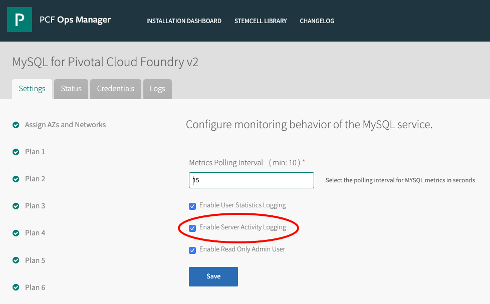

# Example of viewing the MySQL audit logs

* Pre-conditions:
  - You are logged into the VM using `bosh ... ssh ...`
  - Prior to running the following command, you had run `ps -ef | grep mysql` to identify the mysql daemon's PID (here, `12119`)
  - The MySQL tile is configured to provide audit logs (see below)
    

* Find the location of the logs:

```
mysql/3ea109ae-48ba-4d7d-b74f-d34c33ff5043:~# lsof -p 12119 | grep log
mysqld  12119 vcap  mem    REG             202,18    340200 3154050 /var/vcap/data/packages/percona-server/504a5c705b44724b7329bf6800399ba7ed19635a/lib/mysql/plugin/audit_log.so
mysqld  12119 vcap    1w   REG             202,18     27898  655398 /var/vcap/data/sys/log/mysql/mysql.err.log
mysqld  12119 vcap    2w   REG             202,18     27898  655398 /var/vcap/data/sys/log/mysql/mysql.err.log
mysqld  12119 vcap    5uW  REG             202,97 268435456 1966085 /var/vcap/store/mysql/data/ib_logfile0
mysqld  12119 vcap   10uW  REG             202,97 268435456 1966199 /var/vcap/store/mysql/data/ib_logfile1
mysqld  12119 vcap   24uW  REG             202,97     98304 1966371 /var/vcap/store/mysql/data/mysql/slave_relay_log_info.ibd
mysqld  12119 vcap   30w   REG             202,18   1249223  655399 /var/vcap/data/sys/log/mysql/mysql_audit_log
mysqld  12119 vcap   31w   REG             202,18       384  655400 /var/vcap/data/sys/log/mysql/mysql_slow_query.log

```

* Show some of the audit log:

```
mysql/3ea109ae-48ba-4d7d-b74f-d34c33ff5043:~# less /var/vcap/data/sys/log/mysql/mysql_audit_log
"Audit","1_2019-06-19T06:01:13","2019-06-19T06:01:13 UTC","5.7.23-23-log","--defaults-file=/var/vcap/jobs/mysql/config/my.cnf --init-file=/var/vcap/jobs/mysql/scripts/init.sql --daemonize","x86_64-Linux"
"Connect","2_2019-06-19T06:01:13","2019-06-19T06:01:15 UTC","4",0,"mysql-metrics","mysql-metrics","","","localhost","",""
"Query","3_2019-06-19T06:01:13","2019-06-19T06:01:15 UTC","show_status","4",0,"SHOW GLOBAL STATUS","mysql-metrics[mysql-metrics] @ localhost []","localhost","","",""
"Query","4_2019-06-19T06:01:13","2019-06-19T06:01:15 UTC","show_status","4",0,"SHOW GLOBAL STATUS","mysql-metrics[mysql-metrics] @ localhost []","localhost","","",""
"Query","5_2019-06-19T06:01:13","2019-06-19T06:01:15 UTC","show_variables","4",0,"SHOW GLOBAL VARIABLES","mysql-metrics[mysql-metrics] @ localhost []","localhost","","",""
"Connect","6_2019-06-19T06:01:13","2019-06-19T06:01:16 UTC","5",0,"admin","admin","","","localhost","",""
"Query","7_2019-06-19T06:01:13","2019-06-19T06:01:16 UTC","select","5",0,"select @@version_comment limit 1","admin[admin] @ localhost []","localhost","","",""
"Query","8_2019-06-19T06:01:13","2019-06-19T06:01:16 UTC","select","5",0,"SELECT @@global.read_only","admin[admin] @ localhost []","localhost","","",""
"Quit","9_2019-06-19T06:01:13","2019-06-19T06:01:16 UTC","5",0,"admin","admin","","","localhost","",""
"Connect","10_2019-06-19T06:01:13","2019-06-19T06:01:21 UTC","6",0,"admin","admin","","","localhost","",""
"Query","11_2019-06-19T06:01:13","2019-06-19T06:01:21 UTC","select","6",0,"select @@version_comment limit 1","admin[admin] @ localhost []","localhost","","",""
"Query","12_2019-06-19T06:01:13","2019-06-19T06:01:21 UTC","select","6",0,"SELECT @@global.read_only","admin[admin] @ localhost []","localhost","","",""
```

* Use this approach to determine which node in an HA cluster handles a query:
  - BOSH SSH into each of the three nodes in the Galera cluster
  - On each node, `tail -f /var/vcap/data/sys/log/mysql/mysql_audit_log`
  - Run a query
  - Observe which node's log file shows the query


