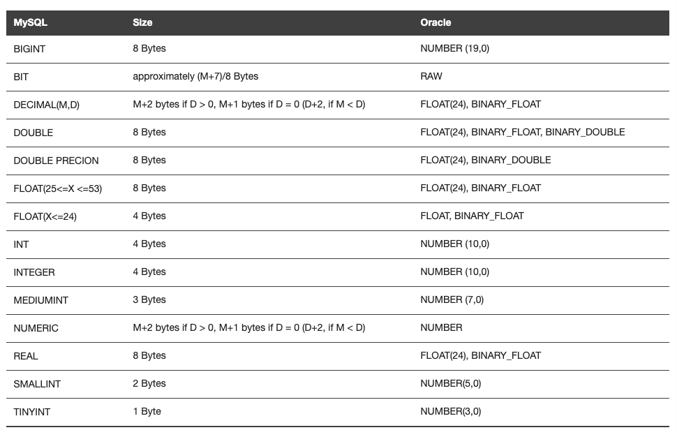

# Workshop to explore various topics related to running the Pivotal MySQL database as a service

## Part 3

### Database installation & configuration

Setup in a cluster; e.g. leader/follower or Galera cluster

Refer to [this section](./workshop_02.md#setup-galera-ha-cluster).

### Data Migration after installation

- Export data from Postgres and import into MySQL.
- [MySQL Workbench](https://dev.mysql.com/doc/workbench/en/wb-migration-database-postgresql.html) offers
  a Postgres migration path, among others.

### Backup and Recovery

### Performance tuning

### DB Monitoring (PMM from Percona is on the roadmap)

### Security (Local account, AD or LDAP)

- Role
- Profile
- Privileges

This is automatically handled by the platform.  When a DB instance is created using
```
$ cf create-service db-service silver mydb
```
a DB role is created with privileges on that DB instance.

### Partition table

- MySQL supports table partitioning
- Queries with predicates containing the partition column(s) can benefit from partition pruning
- The example below is in [this SQL file](./table_partitioning.sql)

```
mysql> -- Example of a partitioned table in MySQL
mysql> -- Ref. https://dev.mysql.com/doc/refman/5.5/en/partitioning-range.html
mysql> DROP TABLE IF EXISTS members;
Query OK, 0 rows affected (0.12 sec)

mysql> CREATE TABLE members
    -> (
    ->   id INT NOT NULL,
    ->   firstname VARCHAR(25) NOT NULL,
    ->   lastname VARCHAR(25) NOT NULL,
    ->   username VARCHAR(16) NOT NULL,
    ->   email VARCHAR(35),
    ->   joined DATE NOT NULL,
    ->   -- PRIMARY KEY (id) /* This won't work. */
    ->   PRIMARY KEY (id, joined) /* The partition columns are required in the PK. */
    -> )
    -> PARTITION BY RANGE COLUMNS (joined)
    -> (
    ->     PARTITION p0 VALUES LESS THAN ('1960-01-01'),
    ->     PARTITION p1 VALUES LESS THAN ('1970-01-01'),
    ->     PARTITION p2 VALUES LESS THAN ('1980-01-01'),
    ->     PARTITION p3 VALUES LESS THAN ('1990-01-01'),
    ->     PARTITION p4 VALUES LESS THAN MAXVALUE
    -> );
Query OK, 0 rows affected (0.15 sec)

mysql> INSERT INTO members VALUES (1, 'Joe', 'Jones', 'jjones', 'jj@acme.com', '1986-07-19');
Query OK, 1 row affected (0.10 sec)

mysql>
mysql> -- Check the "partitions" column, to see which ones are scanned
mysql> EXPLAIN SELECT * FROM members WHERE joined < '1989-01-01';
+----+-------------+---------+-------------+------+---------------+------+---------+------+------+----------+-------------+
| id | select_type | table   | partitions  | type | possible_keys | key  | key_len | ref  | rows | filtered | Extra       |
+----+-------------+---------+-------------+------+---------------+------+---------+------+------+----------+-------------+
|  1 | SIMPLE      | members | p0,p1,p2,p3 | ALL  | NULL          | NULL | NULL    | NULL |    1 |   100.00 | Using where |
+----+-------------+---------+-------------+------+---------------+------+---------+------+------+----------+-------------+
1 row in set, 1 warning (0.10 sec)

mysql>
mysql> -- Add a constraint and recheck the "partitions" column of the explain plan
mysql> EXPLAIN SELECT * FROM members WHERE joined < '1989-01-01' AND joined > '1980-01-01';
+----+-------------+---------+------------+------+---------------+------+---------+------+------+----------+-------------+
| id | select_type | table   | partitions | type | possible_keys | key  | key_len | ref  | rows | filtered | Extra       |
+----+-------------+---------+------------+------+---------------+------+---------+------+------+----------+-------------+
|  1 | SIMPLE      | members | p3         | ALL  | NULL          | NULL | NULL    | NULL |    1 |   100.00 | Using where |
+----+-------------+---------+------------+------+---------------+------+---------+------+------+----------+-------------+
1 row in set, 1 warning (0.15 sec)

mysql>
```

### Triggers
- See https://dev.mysql.com/doc/refman/8.0/en/trigger-syntax.html

### Specific data types



Ref. https://docs.oracle.com/cd/E12151_01/doc.150/e12155/oracle_mysql_compared.htm#BABGACIF

* LOB
  - See https://dev.mysql.com/doc/refman/8.0/en/blob.html
* XML
  - Built-in XML type and functions: https://dev.mysql.com/doc/refman/8.0/en/xml-functions.html
  - Consider an XML to JSON conversion (e.g. https://pypi.org/project/xmljson/), enabling the use of a richer set of JSON operators?
  - Support long and complex XML sql queries
* RAW
  - In MySQL, this is either BIT or BLOB
* LONG RAW
  - In MySQL, this is BLOB or LONGBLOB 
* ROWID & UROWID
  - MySQL doesn’t have this feature, but there are ways to emulate it.
  - Ref. https://stackoverflow.com/questions/2728413/equivalent-of-oracle-s-rowid-in-mysql

### Troubleshooting with logs

* [Here's](https://dev.mysql.com/doc/refman/5.7/en/server-logs.html) a reference on MySQL logs
* [Here](./access_mysql_instance_logs.md) is a walk-through of accessing MySQL instance logs.

### Support feature for installing DB in physical or virtual environment

- Currently, Pivotal MySQL is installable only within a virtual environment
- For physical (bare metal) installations, consider Pivotal Postgres

### Patch release frequency
- Quarterly releases
- We strive for a 48 turnaround for CVEs, and these tend to be in the stemcells rather than the MySQL component specifically

### Patching methods
- Ref. https://docs.pivotal.io/p-mysql/2-5/upgrade.html

